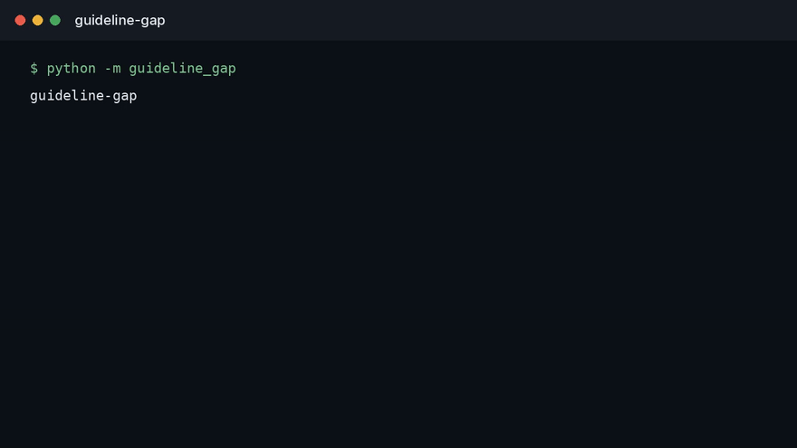

<div align="center">

# guideline-gap

**The distance between what a guideline says and what the record shows was done.**

[](LICENSE)

**Status:** runnable on designed examples. Not a clinical system, a LIMS, or a trained model.

</div>

---

## Watch

<p align="center">
  
</p>

The clip is the working screen: two concordant charts, one unreadable chart, and a gap rate of 0.0. [Open the demo](docs/demo.html). [Full video](docs/demo.mp4).

## The problem

A guideline can be clear and the practice can still diverge: the recommended first test was not ordered, a contraindicated drug appears anyway, or the note cites a recommendation the chart does not follow. Calling every divergence a care failure is how this measurement gets dishonest. Some gaps are documentation. Some are a justified exception. Some are the gap the guideline was written to close.

If the tool cannot tell those apart, it will publish a compliance score that a clinician cannot use.

## The measurement I would trust

One recommendation, one patient record, one of three labels.

| Label | Meaning |
| --- | --- |
| Concordant | The record shows the recommended action, or a documented reason not to take it |
| Gap | The action is absent and no reason is recorded |
| Unreadable | The note does not support either claim, so the tool abstains |

Every label points at the recommendation sentence and the chart span that justified it. A percentage with no spans is not a gap analysis. An abstention counted as a failure is not a gap analysis.

## What this repository is

`guideline-gap` applies the three labels when the chart contains the action, a documented refusal, neither, or almost nothing. Unreadable rows stay out of the gap rate. It is not a medical device and not an audit of a real health system.

## Run

```bash
python3 -m venv .venv
source .venv/bin/activate
pip install -e .
python -m guideline_gap
python -m unittest discover -s tests -v
```

## Author

**Choppa Devasai Pranatheswar** · [LinkedIn](https://www.linkedin.com/in/devasai-pranatheswar)
